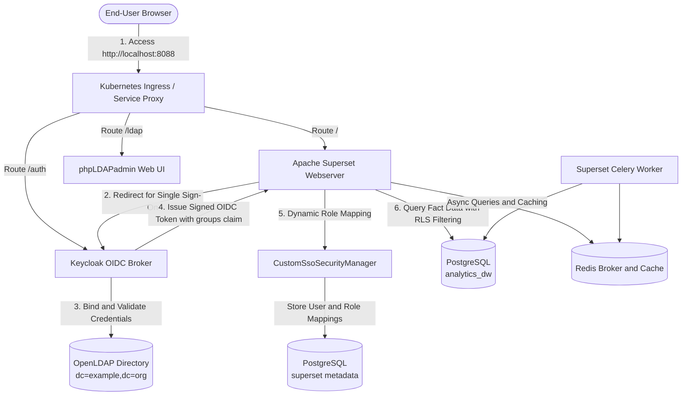

# Enterprise BI Platform: Apache Superset with Keycloak and OpenLDAP

An enterprise-grade Business Intelligence platform deployed on Kubernetes, integrating **Apache Superset**, **Keycloak**, **OpenLDAP**, and **PostgreSQL**.

User identities and group memberships are mastered inside OpenLDAP, federated to Keycloak via OpenID Connect (OIDC), and synchronized dynamically into Apache Superset upon login. Access control is enforced at both the dashboard level (Dashboard RBAC) and the database query layer (Row-Level Security / RLS).

---

## Architecture Diagram



---

## Component Stack

* **Directory Service**: OpenLDAP (`osixia/openldap:1.5.0`) with standard schemas (`ou=users`, `ou=groups`).
* **Directory Administration**: phpLDAPadmin (`osixia/phpldapadmin:0.9.0`) for web-based directory management.
* **Identity and Access Management (IAM)**: Keycloak 24.0.5 running on Quarkus with PostgreSQL storage.
* **Business Intelligence (BI)**: Apache Superset 3.1.1 with Celery worker and Redis broker.
* **Databases**: PostgreSQL 15 hosting both Superset application metadata (`superset`) and business analytics data warehouse (`analytics_dw`).
* **Orchestration and Security**: Kubernetes manifests managed via Kustomize, reinforced by zero-trust Kubernetes NetworkPolicies.

---

## Role and Access Control Matrix

The default password for all seed LDAP users is: `Password123!`

| User Name | LDAP Group | Mapped Superset Roles | Dashboard Visibility | Row-Level Security (RLS) Filter | SQL Lab Access |
| :--- | :--- | :--- | :--- | :--- | :---: |
| `john.admin` | `bi-admins` | `Admin` | All Dashboards (Executive, Finance, Sales) | None (Full 11 orders visible across all departments) | Granted |
| `alice.analyst` | `bi-analysts` | `Alpha` | Executive Enterprise Overview | None (Full raw orders visible for analytical querying) | Granted |
| `bob.finance` | `bi-finance-viewers` | `Gamma`, `Finance_Viewers` | Finance Performance Dashboard only | `department_code = 'FIN'` (Only 4 Finance orders visible) | Denied |
| `carol.sales` | `bi-sales-viewers` | `Gamma`, `Sales_Viewers` | Sales Revenue Dashboard only | `department_code = 'SLS'` (Only 4 Sales orders visible) | Denied |

> [!IMPORTANT]
> **Least Privilege Enforcement**: Users mapped to `Gamma` viewer roles (`Finance_Viewers`, `Sales_Viewers`) are strictly barred from SQL Lab (`can_sqllab`), edit permissions (`can_write`), and administrative panels by `CustomSsoSecurityManager`.

---

## Prerequisites

Before deploying the platform, ensure the following tools are installed and operational:

* Kubernetes cluster (Docker Desktop Kubernetes, Minikube, or Kind).
* `kubectl` CLI configured with cluster-admin access.
* PowerShell 5.1 or PowerShell 7+ on Windows.

---

## Step 1: Manual Step-by-Step Cluster Deployment

Deploy all platform components step-by-step using standard `kubectl` commands.

### 1.1 Create Namespace and Secrets
Initialize the target namespace and load base credentials:

```bash
kubectl apply -f deploy/k8s/namespace.yaml
kubectl apply -f deploy/k8s/secrets.yaml
```

### 1.2 Deploy OpenLDAP and phpLDAPadmin (Phase 1)
Deploy the directory service, bootstrap schemas, and web interface:

```bash
kubectl apply -f deploy/k8s/ldap/configmap.yaml
kubectl apply -f deploy/k8s/ldap/pvc.yaml
kubectl apply -f deploy/k8s/ldap/deployment.yaml
kubectl apply -f deploy/k8s/ldap/service.yaml
kubectl apply -f deploy/k8s/ldap/phpldapadmin.yaml

# Wait for LDAP services to become ready
kubectl wait --for=condition=ready pod -l app=openldap -n superset-bi --timeout=180s
kubectl rollout status deployment/phpldapadmin -n superset-bi --timeout=180s
```

### 1.3 Deploy Keycloak Identity Broker (Phase 1)
Deploy the Keycloak PostgreSQL storage and server with pre-configured realm import:

```bash
kubectl apply -f deploy/k8s/keycloak/postgres-pvc.yaml
kubectl apply -f deploy/k8s/keycloak/postgres-deployment.yaml
kubectl apply -f deploy/k8s/keycloak/postgres-service.yaml
kubectl apply -f deploy/k8s/keycloak/realm-configmap.yaml
kubectl apply -f deploy/k8s/keycloak/deployment.yaml
kubectl apply -f deploy/k8s/keycloak/service.yaml

# Wait for Keycloak to become ready
kubectl wait --for=condition=ready pod -l app=keycloak-db -n superset-bi --timeout=180s
kubectl rollout status deployment/keycloak -n superset-bi --timeout=300s
```

### 1.4 Deploy Apache Superset Infrastructure (Phase 2)
Deploy PostgreSQL, Redis, configuration files, and run database migrations:

```bash
kubectl apply -f deploy/k8s/superset/db-pvc.yaml
kubectl apply -f deploy/k8s/superset/db-deployment.yaml
kubectl apply -f deploy/k8s/superset/db-service.yaml
kubectl apply -f deploy/k8s/superset/redis-deployment.yaml
kubectl apply -f deploy/k8s/superset/redis-service.yaml
kubectl apply -f deploy/k8s/superset/configmap.yaml
kubectl apply -f deploy/k8s/superset/service.yaml

# Wait for Superset database and Redis
kubectl wait --for=condition=ready pod -l app=superset-db -n superset-bi --timeout=180s
kubectl wait --for=condition=ready pod -l app=superset-redis -n superset-bi --timeout=180s

# Run database initialization and migration job
kubectl apply -f deploy/k8s/superset/init-job.yaml
kubectl wait --for=condition=complete job/superset-init -n superset-bi --timeout=300s

# Deploy Superset Web and Celery Worker
kubectl apply -f deploy/k8s/superset/web-deployment.yaml
kubectl apply -f deploy/k8s/superset/worker-deployment.yaml
kubectl rollout status deployment/superset-web -n superset-bi --timeout=300s
kubectl rollout status deployment/superset-worker -n superset-bi --timeout=300s
```

### 1.5 Seed Analytics Data Warehouse and Configure Governance (Phase 3)
Initialize the `analytics_dw` database, populate orders, and register Row-Level Security rules:

```bash
# 1. Create analytics_dw database in PostgreSQL
kubectl exec -n superset-bi deployment/superset-db -- psql -U superset -d postgres -c "CREATE DATABASE analytics_dw;"

# 2. Populate dimensions and fact orders
kubectl exec -i -n superset-bi deployment/superset-db -- psql -U superset -d analytics_dw < data/schema.sql

# 3. Register database, dataset, and RLS rules in Superset
kubectl exec -i -n superset-bi deployment/superset-web -- python < scripts/configure-superset-governance.py

# 4. Attach analytical charts and layouts to dashboards
kubectl exec -i -n superset-bi deployment/superset-web -- python < scripts/populate-dashboards.py
```

### 1.6 Apply Ingress and Zero-Trust Network Policies (Phase 4)
Protect inter-pod communication and configure HTTP routing:

```bash
kubectl apply -f deploy/k8s/ingress.yaml
kubectl apply -f deploy/k8s/network-policies.yaml
```

*(Note: You can also deploy all YAML manifests in a single command using `kubectl apply -k deploy/k8s` and then execute the schema seeding and governance scripts in step 1.5).*

---

## Step 2: Establish Local Port Forwarding

Open separate terminal windows and run the following commands to expose the services to your local machine:

```powershell
# Terminal 1: Apache Superset Web Interface
kubectl port-forward svc/superset -n superset-bi 8088:8088

# Terminal 2: Keycloak Administration and SSO Broker
kubectl port-forward svc/keycloak -n superset-bi 8080:8080

# Terminal 3: phpLDAPadmin Directory Management GUI
kubectl port-forward svc/phpldapadmin -n superset-bi 8085:80
```

---

## Step 3: Accessing Superset via Keycloak Single Sign-On

### 3.1 Sign In with Keycloak
1. Open your web browser and navigate to: [http://localhost:8088](http://localhost:8088)
2. On the Superset landing page, click the **"SIGN IN WITH KEYCLOAK"** button:


3. Superset will redirect your browser to the Keycloak authentication screen.

### 3.2 Enter Credentials
On the Keycloak login page:
* In the **Username or email** field, enter your LDAP username (for example, `john.admin` or `bob.finance`).
* In the **Password** field, enter: `Password123!`
* Click **Sign In**:


### 3.3 Dynamic User Provisioning and Role Assignment
Once authenticated:
1. Keycloak validates the password against OpenLDAP, extracts group memberships, and signs an OpenID Connect token containing the `groups` array claim.
2. Superset's `CustomSsoSecurityManager` receives the token, creates the user account on demand, and assigns the mapped roles.
3. If you log in as an administrator (such as `john.admin`), you can navigate to **Settings > List Users** to view all registered users and their synchronized roles:


---

## Step 4: Managing LDAP Users via phpLDAPadmin

You can inspect directory objects, create new users, and assign department groups using the web-based phpLDAPadmin interface.

### 4.1 Log In to phpLDAPadmin
1. Navigate to: [http://localhost:8085](http://localhost:8085)
2. In the left navigation panel, click **Login**:
   * **Login DN**: `cn=admin,dc=example,dc=org`
   * **Password**: `adminpassword`
3. Click **Authenticate**.

### 4.2 Inspect the Directory Tree
Expand the tree on the left side by clicking the `+` icons next to:
* `dc=example,dc=org`
  * `ou=groups`: Contains the department role groups (`cn=bi-admins`, `cn=bi-analysts`, `cn=bi-finance-viewers`, `cn=bi-sales-viewers`).
  * `ou=users`: Contains the active user accounts.


### 4.3 Step-by-Step: Create a New Administrator User
Follow these exact steps to add a new employee and grant them administrator access:

1. **Create the User Entry**:
   * In the left panel, click on **`ou=users`**.
   * In the main right pane, click **"Create a child entry"**.
   * Select **"Generic: User Account"** (or `inetOrgPerson`).
   * Fill in the user details:
     * **First name (givenName)**: `Mehmet`
     * **Last name (sn)**: `Admin`
     * **Common Name (cn)**: `Mehmet Admin`
     * **User ID (uid)**: `mehmet.admin` (This is the login username).
     * **Email (mail)**: `mehmet.admin@example.org`
     * **Password (userPassword)**: `Password123!`
   * Click **Create Object**, then click **Commit**.

2. **Assign the User to the `bi-admins` Group**:
   * In the left tree, under `ou=groups`, click directly on **`cn=bi-admins`**.
   * In the right pane, locate the **`member`** attribute section.
   * Click the blue **`(add value)`** link directly below the `member` input box.
   * In the new input field that appears, paste the full Distinguished Name (DN) of the new user:
     ```text
     uid=mehmet.admin,ou=users,dc=example,dc=org
     ```
   * Scroll to the bottom of the page and click **"Update Object"** to save changes.

3. **Verify Login in Superset**:
   * Go to [http://localhost:8088](http://localhost:8088) and click **"SIGN IN WITH KEYCLOAK"**.
   * Enter username: `mehmet.admin` and password: `Password123!`.
   * Superset will automatically provision the user with the **`Admin`** role on first login.

---

## Step 5: Multi-Tenant Data Governance and Row-Level Security

The PostgreSQL analytics database (`analytics_dw`) stores business orders across multiple departments:
* `FIN`: Finance and Accounting
* `SLS`: Sales and Commercial
* `OPS`: Global Operations

### Pre-Built Dashboards
Open the **Dashboards** menu in Superset to view:
* **Executive Enterprise Overview**: Shows full corporate order volumes and revenue across all departments. Restricted to `Admin` and `Alpha` roles.
* **Finance Performance Dashboard**: Shows treasury, tax, and ERP audit orders. Bound to the `Finance_Viewers` role.
* **Sales Revenue Dashboard**: Shows regional CRM and commercial licensing sales. Bound to the `Sales_Viewers` role.

### Row-Level Security Enforcement
When users query datasets or view dashboards:
* An **Admin** or **Analyst** (`john.admin`, `alice.analyst`) sees all 11 orders with total revenue of $2,615,000.
* A **Finance Viewer** (`bob.finance`) sees only the 4 Finance orders with total revenue of $865,000. All Sales and Operations rows are filtered out by the database engine via clause `department_code = 'FIN'`.
* A **Sales Viewer** (`carol.sales`) sees only the 4 Sales orders with total revenue of $630,000. All other department rows are filtered out via clause `department_code = 'SLS'`.

---

## Step 6: Automated End-to-End Compliance Testing

To verify all components, security rules, and permission boundaries automatically, run the unified verification runner:

```powershell
.\scripts\run-e2e-tests.ps1
```

The script executes three sequential testing phases:
* **Phase 1**: Asserts OpenLDAP user and group schemas, and performs Direct Access Grant token requests against Keycloak to verify `groups` claim generation.
* **Phase 2**: Verifies Superset database readiness, Redis cache responsiveness, and checks that `CustomSsoSecurityManager` correctly maps LDAP groups to Superset roles.
* **Phase 3**: Connects to `analytics_dw`, compiles RLS SQL predicates for each persona, and validates that queries return only authorized department rows.

Expected test result output:
```text
==================================================================
                      E2E TEST SCORECARD                          
==================================================================
 [PASS] Phase 1: LDAP Directory & Keycloak Federation
 [PASS] Phase 2: Superset SSO & Dynamic RBAC Engine
 [PASS] Phase 3: Multi-Tenant Data Governance & RLS Filtering
------------------------------------------------------------------
 [ALL TESTS PASSED] Architecture fully compliant with AGENTS.md!
```

---

## Step 7: Platform Teardown

To clean up and remove resources created by the platform:

```powershell
# Remove all deployments, services, and network policies (preserves PVC data volumes)
.\scripts\teardown.ps1

# Remove all workloads and delete persistent volumes
.\scripts\teardown.ps1 -DeletePvc

# Completely delete the superset-bi namespace
.\scripts\teardown.ps1 -DeleteNamespace
```

---

## Repository Structure

```
├── AGENTS.MD                               # System requirements and autonomous agent blueprint
├── README.md                               # Operational guide and platform documentation
├── .env.example                            # Configuration environment template
├── data/
│   └── schema.sql                          # Analytics DW schema and mock orders seed
├── deploy/
│   └── k8s/                                # Kubernetes manifests (Kustomize)
│       ├── kustomization.yaml              # Master Kustomize file
│       ├── namespace.yaml                  # 'superset-bi' namespace specification
│       ├── secrets.yaml                    # Base64 credentials abstraction
│       ├── ingress.yaml                    # Ingress resource for web, SSO, and LDAP UI
│       ├── network-policies.yaml           # Zero-trust inter-pod network isolation
│       ├── ldap/                           # OpenLDAP and phpLDAPadmin manifests
│       ├── keycloak/                       # Keycloak and Keycloak-DB manifests
│       └── superset/                       # Superset web, worker, db, redis, init-job
├── docs/
│   ├── images/                             # Instructional screenshots
│   └── rls_matrix.md                       # Comprehensive RLS mapping specification
├── iam/
│   ├── ldap/bootstrap.ldif                 # Seed users and organizational groups
│   └── keycloak/realm-export.json          # Pre-configured realm with LDAP federation
├── scripts/
│   ├── run-e2e-tests.ps1                   # Consolidated E2E test runner
│   ├── teardown.ps1                        # Cluster cleanup and resource removal
│   ├── configure-superset-governance.py    # Database, dataset, and RLS provisioning
│   ├── populate-dashboards.py              # Visual charts and dashboard layout generator
│   ├── create-sample-ldap-user.ps1         # Automated LDAP user creation script
│   ├── verify-new-user-sso.ps1             # Verification script for newly created user
│   ├── verify-phase1.ps1                   # Phase 1 LDAP/Keycloak verification
│   ├── verify-phase2.ps1                   # Phase 2 Superset SSO verification
│   └── verify-phase3.ps1                   # Phase 3 RLS and RBAC verification
└── superset/
    ├── config/superset_config.py           # Superset configuration with OAuth provider
    ├── docker/Dockerfile                   # Production container build specification
    └── security/custom_sso_security_manager.py # Custom FAB Security Manager
```
